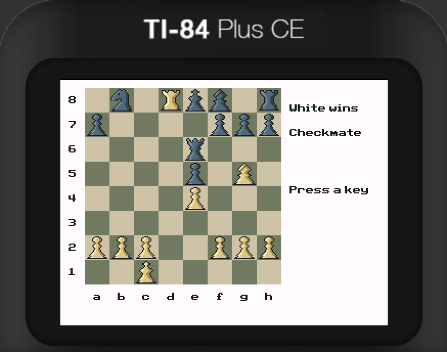

# MinTI-Chess 🍃
MinTI is the world's strongest chess engine for the TI-84 Plus CE graphing calculator, running natively on a 24-bit ADL CPU with under 128KiB of RAM.

## Features
MinTI is an ambitious engine, implementing:
- Principal variation search
- Quiescence search with stand-pat and delta pruning
- 64KB transposition table
- Strong move ordering (killers, history heuristic, MVV-LVA, PV, TT moves)
- Null move pruning
- Autotuned staged evaluation

It's explicitly optimized and designed for the TI-84 Plus CE calculator, and is around an order of magnitude faster than existing engines (in nodes/second):
- Unused VRAM frame buffers are mapped for use by MinTI's data structures
- Custom incrementally maintained additive hashing designed for the 24-bit eZ80
- Incrementally maintained evaluation
- Amortized legality checking

Together, this allows MinTI to defeat strong existing engines such as [Chess84](https://github.com/thewarrenjames/Chess84) and [ChessCE/ChessCCE](https://www.ticalc.org/archives/files/fileinfo/468/46800.html)*.

| Opponent         | MinTI as White | MinTI as Black |
|------------------|------------------------|------------------------|
| Chess84          | 99%: 98 wins, 2 draws, 0 losses | 97%: 94 wins, 6 draws, 0 losses |
| ChessCE/ChessCCE | 97%: 94 wins, 6 draws, 0 losses | 98.5%: 97 wins, 3 draws, 0 losses |

Playing MinTI myself on my calculator, I'd estimate its strength at **2000-2100** chess[dot]com blitz, and it's a seriously challenging opponent for me.

Stockfish comparisions suggest that MinTI is even stronger than that: 
| Opponent         | MinTI Score | MinTI's Estimated Elo |
|------------------|------------------------|------------------------|
| Stockfish UCI 1900 | 72.5%: 66 wins, 13 draws, 21 losses | **2068.4** (+168.4) |
| Stockfish UCI 2100 | 52%: 41 wins, 22 draws, 37 losses | **2139** (+13.9) |

* 200 games were played from 100 balanced early opening positions, so each engine could play both sides of the position.  Starting positions and game PGNs [here (Pastebin)](https://pastebin.com/u/NinjadenMu/1/vAAY1jwN).  
Interestingly, Chess84 beats ChessCE by a significant margin with 67 wins, 117 draws, and 16 losses, so the comparision with MinTI is somewhat non-monotonic.

## Usage
MinTI can be built for both the calculator and modern computers.  Moves may be inputted using UCI notation.

#### Host (your normal computer):
Clone and build with `make -f host.mk`.  Run the created `build/host/minti-host` executable.  The CE Libraries and Toolchain are not required.  

Upon running `minti-host`, you will have the option to either simulate the calculator's capabilities or play at the host's full capacity, which is easily at the level of strong masters.

#### Calculator:
Install from [ticalc.org](), or clone and build with `make gfx` followed by `make` using the [CE Toolchain](https://ce-programming.github.io/toolchain/static/getting-started.html).  Both methods require the CE Libraries (`clibs.8xg`) which may be downloaded [here](https://github.com/CE-Programming/libraries/releases/tag/v15.0).  Recent Texas Instruments OS versions block user assembly execution, so you may also need to install the [arTIfiCE](https://github.com/YvanTT/arTIfiCE/releases/tag/v2.1) launcher.  Send all required files to your calculator using TI Connect CE.

You can directly use your keypad to interact with MinTI's calculator GUI.  Letters can be typed without entering "alpha" mode.

## Future Work
MinTI's non-engine feature set are minimal right now.  I'd love to be able to add more features like saving games, loading custom positions, and new customization options.

MinTI also doesn't implement late move reductions or futility pruning.  This is intentional, since reductions are tactically risky with MinTI's limited search depth on the calculator (4-5 ply), and would likely have to be quite aggressive to actually improve MinTI's search depth consistently.  That being said, I think they might work with some tuning and experimentation, so this will be a good excuse for me to revisit in the future :)
